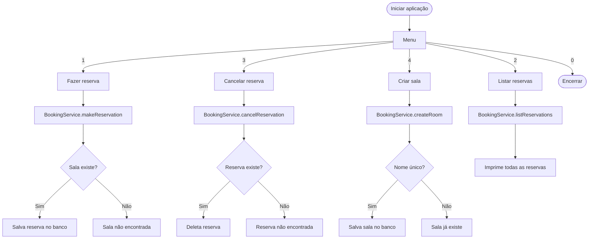

# reserva-salas-cli

Sistema de reserva de salas de reunião via **terminal (CLI)** — menu interativo que permite criar salas, fazer reservas, listar e cancelar, com persistência em banco PostgreSQL via Spring Boot e JPA.

[](https://openjdk.org/projects/jdk/21/)
[](https://spring.io/projects/spring-boot)
[](https://www.postgresql.org/)
[](LICENSE)

---

## Como funciona



---

## Funcionalidades

- **Criar sala** — cadastra sala com nome único (validação de duplicata)
- **Fazer reserva** — associa usuário a uma sala existente
- **Listar reservas** — exibe todas as reservas ativas
- **Cancelar reserva** — remove reserva pelo nome do usuário e da sala

---

## Stack

| Tecnologia | Versão | Uso |
|---|---|---|
| Java | 21 | Linguagem principal |
| Spring Boot | 3.2.2 | Injeção de dependência e contexto |
| Spring Data JPA | — | Persistência ORM |
| PostgreSQL | — | Banco de dados relacional |
| Lombok | 1.18.36 | Redução de boilerplate |

> **Por que Spring Boot em uma CLI?**  
> O Spring gerencia injeção de dependência e a camada de persistência (JPA/Hibernate), eliminando configuração manual. A interface de entrada é o terminal, mas toda a lógica de banco é gerenciada pelo framework.

---

## Como Executar

### Pré-requisitos
- Java 21
- PostgreSQL rodando localmente
- Banco `reserva_sala` criado

```sql
CREATE DATABASE reserva_sala;
```

### Configuração

Crie um arquivo `.env` ou defina as variáveis de ambiente:

```bash
export DB_URL=jdbc:postgresql://localhost:5432/reserva_sala
export DB_USERNAME=postgres
export DB_PASSWORD=sua_senha
```

Ou edite diretamente o `application.properties` para desenvolvimento local.

### Executar

```bash
git clone https://github.com/odavid062/atvRafael2.git
cd atvRafael2
./mvnw spring-boot:run
```

O menu interativo será exibido no terminal:

```
1 - Fazer reserva
2 - Listar reservas
3 - Cancelar reserva
4 - Criar sala
0 - Sair
Escolha uma opção:
```

---

## Estrutura do Projeto

```
src/main/java/org/example/
├── Main.java                          # Ponto de entrada + menu CLI (Scanner)
├── Model/
│   ├── Room.java                      # Entidade sala (nome único)
│   └── Reservation.java               # Entidade reserva (sala + usuário)
├── Repository/
│   ├── RoomRepository.java            # findByName, existsByName
│   └── ReservationRepository.java     # findByRoomNameAndUser
└── Service/
    └── BookingService.java            # Regras: reservar, cancelar, listar, criar sala
```

---

## Observações Técnicas

- `@Column(name = "username")` na entidade `Reservation` — evita conflito com a palavra reservada `user` no PostgreSQL
- Validação de unicidade da sala feita antes de persistir (`existsByName`)
- Constructor injection no `BookingService` (sem `@Autowired` em campo)

---

## Autor

**David Rodrigues**
[](https://github.com/odavid062)
